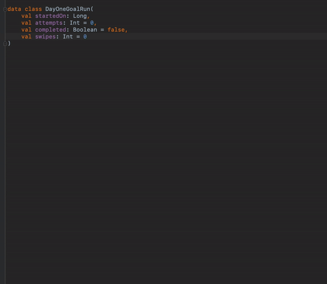

# Kotlin Data Class to SharedPreferences plugin for Android Studio
Android Studio plugin to generate SharedPreferences reader / writer class based on Kotlin data class fields

## Installation & Usage
1. Download from the [release page](https://github.com/hbmartin/android-studio-sharedprefs-from-data-class/releases), search for "Kotlin Data Class to SharedPreferences" in Preferences > Plugins, or visit the [plugin listing page](https://plugins.jetbrains.com/plugin/14970-kotlin-data-class-to-sharedpreferences/)

2. Place your cursor inside a data class, bring up the generator menu (command-N or control-return usually), and choose "Generate SharedPrefs"

3. 🚀

## Contributing

* [PRs](https://github.com/hbmartin/android-studio-sharedprefs-from-data-class/pulls) and [bug reports / feature requests](https://github.com/hbmartin/android-studio-sharedprefs-from-data-class/issues) are all welcome!
* This project is linted with [ktlint](https://github.com/pinterest/ktlint) via [ktlint-gradle](https://github.com/JLLeitschuh/ktlint-gradle/tags) and performs static analysis with [detekt](https://github.com/detekt/detekt)
* Treat other people with helpfulness, gratitude, and consideration! See the [Android SE CoC](https://android.stackexchange.com/conduct)

## Authors

* [Harold Martin](https://www.linkedin.com/in/harold-martin-98526971/) - harold.martin at gmail
* Significant inspiration drawn from [android-parcelable-intellij-plugin-kotlin by nekocode](https://plugins.jetbrains.com/plugin/8086-parcelable-code-generator-for-kotlin-)

## License

[MIT](LICENSE)

